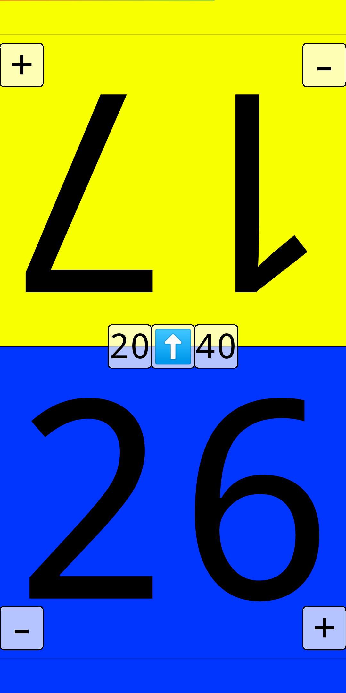

# LifeWrench
LifeWrench is a Magic: The Gathering helper app for Android
![The default layout: In the middle of the screen are three buttons: one with a 20, one with a 🔃 and one with a 40. The screen is vertically split up into two halves. For each side there is a bar at the bottom filled with the whole spectrum of all the colours. Above that are two buttons, one with a plus and one with a minus. And finally, above that is a very big 20 that takes up most of that half of the screen. The bottom half of the screen has a red background and the top half has a green background.](default.png)

# Features
- Health counter for two player on opposite sides
- Every player can increment and decrement their own health with the `+` and `-` buttons
  - You can hold the buttons to rapidly increment or decrement health\
  
- Players can also change their background colour by sliding through the colour spectrum at the bottom of their side (after a few seconds the spectrum will disappear to get out of the way, but you can still change your colour at any time just by sliding again)
- In the middle are three buttons usually used for the start of the game:
  - The `20` and `40` buttons set the health of both players to that number
  - If you press the `🔃` button a random player is chosen with a fun little animation\
  

# [Click here to download!](https://github.com/TechnicJelle/LifeWrench/releases/download/v1.0.0/LifeWrench_v1.0.0.apk)